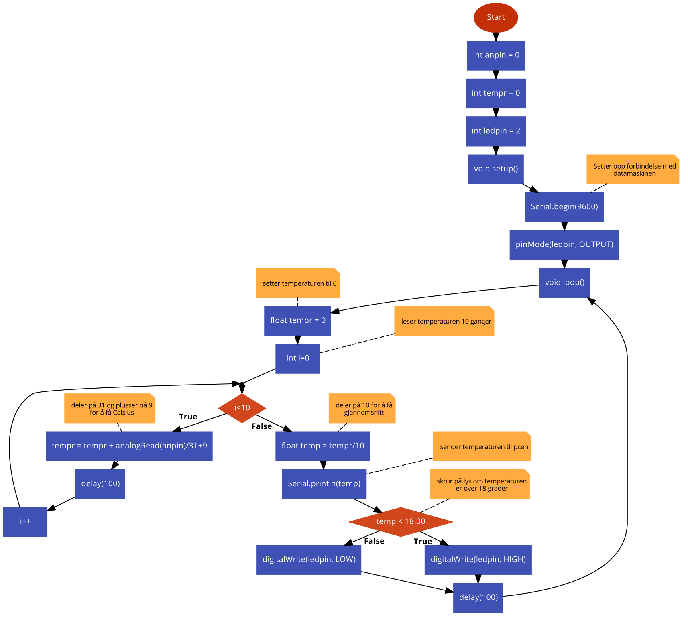
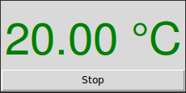

# Temperaturleser 


Det første prosjektet vi lagde med arduinoen var en temperaturleser. Den bruker en temperaturleser fra et større anlegg. Temperaturleseren kan lese 9 &deg;C til 42 &deg;C. Den sender ut en spenning mellom 0 og 10 volt avhengig av temperaturen. Vi opplevde at signalet var veldig ustabilt, så vi brukte en kondensator og en spole for å gjøre det mer stabilt. For å bruke en analog port på arduinoen for å lese av dette signalet, måtte vi også halvere spenningen før den kom inn.

Programmet gjør så dette signalet om til Celsius verdien og sender dette over Serieporten til pcen. På pcen kjører et Python skript som gjør temperaturdataene litt penere og viser dette i et grafisk program.





## Arduino kode

For å lese spenningen fra temperaturleseren bruker vi analogRead(). Den leser en spenning på 0-5 volt og gir verdien med 10-bits. Vi får altså en verdi mellom 0 og 1023. For å vise Celsius, må vi først dele verdien på 31 for å få stigning med 1 celsius. Siden den laveste målbare temperaturen er 9 &deg;C, må vi plusse på 9. Da kan verdien bare være mellom 9 &deg;C og 42 &deg;C. Pga. mye støy, leser vi temperaturen 10 ganger og går videre med gjennomsnittet. Vi har også en led som lyser hvis temperaturen er mindre enn 18 &deg;C.

```cpp
int anpin = 4;
int tempr = 0;
int ledpin = 2;

void setup()
{
	//Setter opp forbindelse med datamaskinen
	Serial.begin(9600);
	pinMode(ledpin, OUTPUT);
}

void loop()
{
	//setter temperaturen til 0
	float tempr = 0;
	//leser temperaturen 10 ganger
	for(int i=0; i<10; i++){
		tempr = tempr + analogRead(anpin)/31+9; //deler på 31 og plusser på 9 for å få Celsius
		delay(100);
	}
	//deler på 10 for å få gjennomsnitt
	float temp = tempr/10;
	//sender temperaturen til pcen
	Serial.println(temp);

	//skrur på lys om temperaturen er over 18 grader
	if (temp < 18.00){
		digitalWrite(ledpin, HIGH); // Skrur på ledpin
	}
	else{
		digitalWrite(ledpin, LOW); // Skrur av ledpin
	}
	delay(100); // Venter i 0.1 sekunder
}
```

## Python kode

For å kjøre python skriptet trenger du et par ting:

* **Python 2.x eller 3.x** For å laste ned python til Windows kan du [klikke her](https://www.python.org/downloads/windows/). For Ubuntu er Python 2 og python 3 allerede installert, men hvis du vil laste det ned på et annet os eller en annen versjon, kan du skrive `sudo apt-get install python`

* **pySerial** Dette er en python pakke som lar deg sende og motta serie data fra arduinoen. Med python installert kan du skrive `pip install pyserial` for å installere denne.

* **Tkinter** Dette er en annen pakke vi bruker for å lage grafiske brukergrensesnitt med python. Dette kan installeres ved å skrive `sudo apt-get install python-tk`

Programmet leser siste linjen med seriadata sendt fra arduinoen og setter dette inn i en "label" med et gradetegn. Dette vises i en boks, i tilegg til en stop knakk som lukker programmet.

Python skriptet blir seende slik ut:



```python
# Importerer tkinter og pySerial
from Tkinter import *
import serial

# Setter ser til aa lese seriedata fra /dev/ttyACM0
# og overforingshastighet 9600
ser = serial.Serial('/dev/ttyACM0', 9600)

# Lager en label med temperaturen, gradetegn og "C"
def counter_label(label):
  def count():
    temp = ser.readline().strip()
    label.config(text = temp + " " + u"\N{DEGREE SIGN}" + "C"  )
    label.after(1000, count)
  count()

# Gjor klar vinduet
root = Tk()
root.title("Temperatur") # Setter tittel på vinduet
label = Label(root, fg="green", font=("Helvetica", 42)) # Setter farge, font og
                                                        # storelse på teksten
label.pack()
counter_label(label) # Setter inn teksten ovenifra
# Legger til en knapp som lukker programmet
button = Button(root, text='Stop', width=25, command=root.destroy)
button.pack()
# Apner vinduet
root.mainloop()
```

